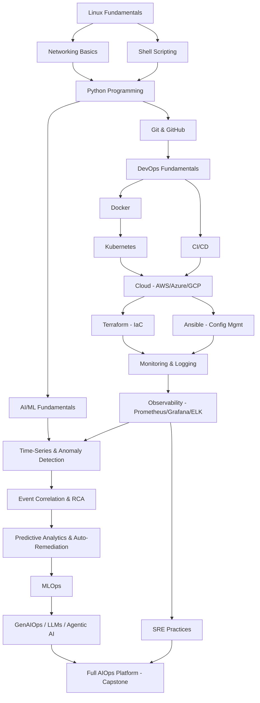
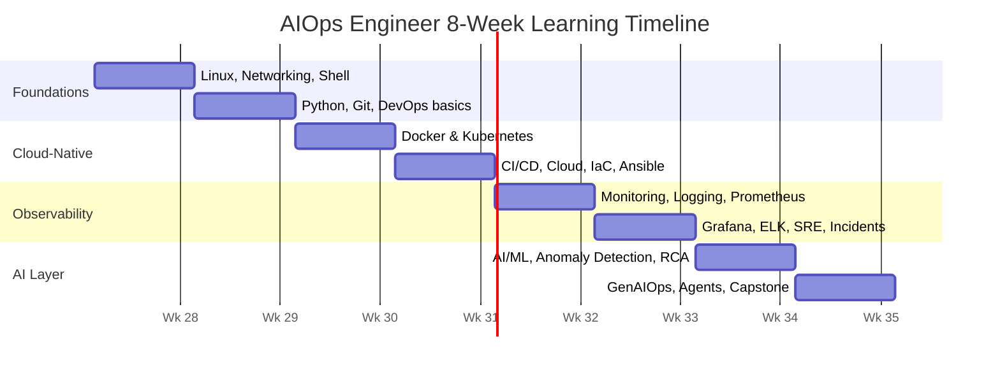
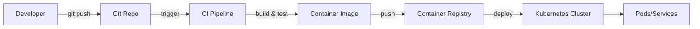
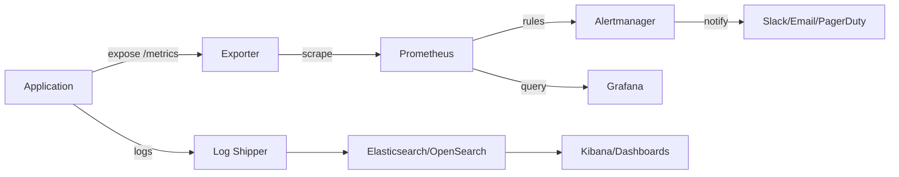
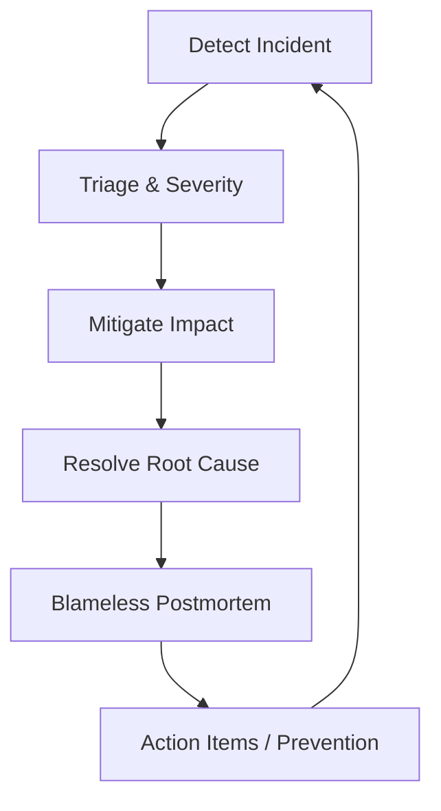
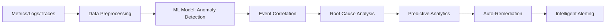
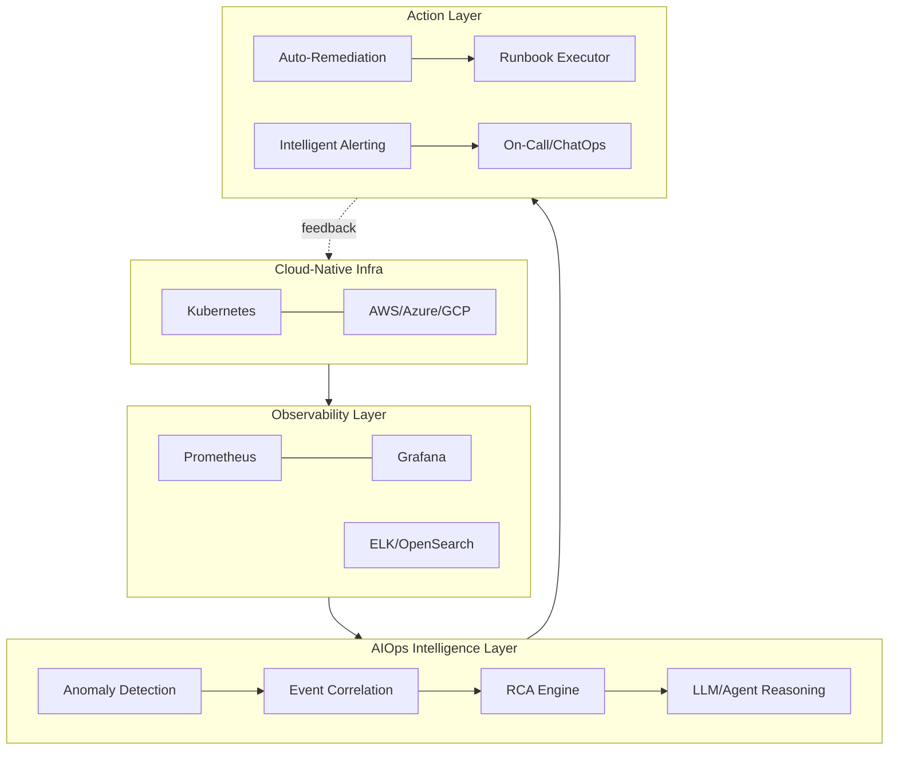

# From Zero to Professional AIOps Engineer — 8-Week Roadmap

**Format:** 2 hours/day, 7 days/week (adjust to 5–6 if needed, just shift dates)
**Outcome:** Job-ready AIOps Engineer who can build, monitor, and self-heal a cloud-native system using AI/ML

---

## How This Program Works

Each week below has:
- **Weekly goal** — what you'll be able to *do* by Sunday
- **Daily 2-hour blocks** — topic + hands-on task
- **Weekly project** — ships every week, builds toward the capstone
- **Weekly assessment** — quiz + practical check
- **Monthly assessment** — end of Week 4 and Week 8

When we work through each day together, every topic gets the full treatment: what/why/where/how it works internally, a demo, a hands-on lab, a real-world scenario, common mistakes, troubleshooting, and a quiz. This document is the map — we'll walk it one day at a time.

---

## Skill Dependency Map

## 8-Week Timeline

---

## Week 1 — Linux, Networking & Shell Foundations
**Goal:** Comfortably navigate Linux, understand networking basics, automate tasks with shell scripts.

| Day | Topic | Hands-on Task |
|---|---|---|
| 1 | Linux fundamentals: filesystem, permissions, processes | Set up Ubuntu VM/WSL, navigate FS, `chmod`/`chown` lab |
| 2 | Linux package mgmt, systemd, services | Install/manage services, write a systemd unit file |
| 3 | Networking basics: TCP/IP, DNS, HTTP/HTTPS | `curl`, `dig`, `netstat`/`ss`, trace a request |
| 4 | Networking deep dive: ports, firewalls, load balancers | Configure `ufw`, simulate LB with nginx |
| 5 | Shell scripting fundamentals: variables, loops, conditionals | Write a log-cleanup bash script |
| 6 | Shell scripting advanced: functions, cron, error handling | Build a cron-scheduled backup script |
| 7 | **Weekly Project:** "Server Health Check Script" — CPU/mem/disk/service checks, alert via email | Ship to GitHub |

**Assessment:** 15-question quiz + practical (write a script that checks disk usage and rotates logs).

---

## Week 2 — Python, Git & DevOps Fundamentals
**Goal:** Write Python automation scripts, use Git/GitHub professionally, understand the DevOps lifecycle.

| Day | Topic | Hands-on Task |
|---|---|---|
| 1 | Python basics: syntax, data structures | Parse a log file with Python |
| 2 | Python intermediate: functions, OOP, error handling | Build a CLI tool with `argparse` |
| 3 | Python for automation: `requests`, `subprocess`, APIs | Call a REST API and process JSON |
| 4 | Git fundamentals: commits, branches, merges | Practice branching workflow |
| 5 | GitHub: PRs, Actions basics, collaboration | Open a PR, set up a basic GitHub Action |
| 6 | DevOps fundamentals: culture, lifecycle, tooling landscape | Map a sample SDLC pipeline |
| 7 | **Weekly Project:** "Log Parser + Alert Bot" (Python) | Ship to GitHub with README |

**Assessment:** Quiz + practical (Python script that flags anomalies in a CSV of server logs).

**Monthly Assessment 1 (end of Week 2 core-basics checkpoint):** Combined Linux+Python+Git practical exam.

---

## Week 3 — Docker & Kubernetes
**Goal:** Containerize an app and deploy it on Kubernetes.

| Day | Topic | Hands-on Task |
|---|---|---|
| 1 | Docker fundamentals: images, containers, Dockerfile | Containerize the Week 2 Python app |
| 2 | Docker networking, volumes, Compose | Multi-container app with `docker-compose` |
| 3 | Kubernetes fundamentals: pods, deployments, services | Deploy app on Minikube/Kind |
| 4 | Kubernetes: ConfigMaps, Secrets, namespaces | Externalize app config |
| 5 | Kubernetes: scaling, health checks, rolling updates | HPA + liveness/readiness probes |
| 6 | Kubernetes architecture internals (control plane, etcd, kubelet) | Diagram + break/fix lab |
| 7 | **Weekly Project:** "Containerized Microservice on K8s" | Ship manifests to GitHub |

**Assessment:** Quiz + practical (fix a broken Deployment YAML; explain pod scheduling failure).

---

## Week 4 — CI/CD, Cloud, Terraform & Ansible
**Goal:** Automate build-test-deploy pipelines and provision cloud infra as code.

| Day | Topic | Hands-on Task |
|---|---|---|
| 1 | CI/CD concepts + GitHub Actions pipeline | Build/test/push pipeline for K8s app |
| 2 | Cloud fundamentals: AWS/Azure/GCP core services | Launch a free-tier VM + storage bucket |
| 3 | Cloud networking: VPC, subnets, security groups | Design a 2-tier VPC |
| 4 | Terraform fundamentals: providers, state, resources | Provision VM via Terraform |
| 5 | Terraform modules & remote state | Modularize infra code |
| 6 | Ansible fundamentals: playbooks, inventories, roles | Automate app deployment with Ansible |
| 7 | **Weekly Project:** "Fully Automated CI/CD → Cloud Deploy" | Terraform + Ansible + GitHub Actions pipeline |

**Assessment:** Quiz + practical (write a Terraform module + Ansible playbook for a 2-tier app).

**Monthly Assessment 2 (end of Week 4):** Deploy a full app from git push → running in cloud, unassisted.

---

## Week 5 — Monitoring, Logging & Prometheus
**Goal:** Instrument systems and understand the three pillars of observability.

| Day | Topic | Hands-on Task |
|---|---|---|
| 1 | Monitoring vs logging vs tracing vs observability | Conceptual map + real examples |
| 2 | Prometheus fundamentals: metrics, PromQL | Instrument app with `/metrics` endpoint |
| 3 | Prometheus architecture: exporters, service discovery | Deploy `node_exporter`, scrape configs |
| 4 | Alertmanager: rules, routing, silencing | Write alerting rules for CPU/latency |
| 5 | OpenTelemetry fundamentals | Instrument app with OTel SDK |
| 6 | eBPF-based observability (intro) | Explore `bpftrace`/Pixie demo |
| 7 | **Weekly Project:** "Metrics Pipeline for K8s App" | Prometheus + Alertmanager on the Week 3 app |

**Assessment:** Quiz + practical (write 5 PromQL queries; debug a broken scrape config).

---

## Week 6 — Grafana, ELK, SRE & Incident Management
**Goal:** Build dashboards, centralize logs, and run incidents like an SRE.

| Day | Topic | Hands-on Task |
|---|---|---|
| 1 | Grafana fundamentals: data sources, panels | Build a dashboard for Prometheus metrics |
| 2 | Grafana advanced: alerting, variables, dashboards-as-code | Provision dashboard via JSON/Terraform |
| 3 | ELK/OpenSearch stack fundamentals | Ship container logs to ELK |
| 4 | Log querying, parsing (Logstash/Grok), Kibana | Build a log dashboard |
| 5 | SRE fundamentals: SLIs, SLOs, error budgets | Define SLOs for the app |
| 6 | Incident management: on-call, runbooks, postmortems | Write a runbook + blameless postmortem |
| 7 | **Weekly Project:** "Full Observability Stack" | Prometheus+Grafana+ELK unified for the app |

**Assessment:** Quiz + practical (define SLO/error budget for a service; simulate an incident + postmortem).

---

## Week 7 — AI/ML Foundations, Anomaly Detection & RCA
**Goal:** Apply ML to operational data — the core of AIOps.

| Day | Topic | Hands-on Task |
|---|---|---|
| 1 | AI/ML fundamentals: supervised/unsupervised, model lifecycle | Train a simple classifier on sample data |
| 2 | Time-series analysis: trends, seasonality, stationarity | Analyze CPU metrics time-series |
| 3 | Data preprocessing for ops data | Clean + feature-engineer metrics dataset |
| 4 | Anomaly detection: statistical + ML methods (Z-score, Isolation Forest, Prophet) | Detect anomalies in metrics stream |
| 5 | Event correlation & noise reduction | Correlate multi-service alerts into one incident |
| 6 | Root Cause Analysis (RCA) with ML + causal graphs | Build a simple RCA pipeline |
| 7 | **Weekly Project:** "AI Anomaly Detector for Metrics" | Python/ML service flags anomalies from Prometheus data |

**Assessment:** Quiz + practical (train + evaluate an anomaly detector; explain false-positive tradeoffs).

---

## Week 8 — GenAIOps, Agentic AI, MLOps & Capstone
**Goal:** Apply LLMs/agents to ops workflows and ship the full end-to-end platform.

| Day | Topic | Hands-on Task |
|---|---|---|
| 1 | MLOps fundamentals: model versioning, retraining, monitoring | Set up a simple MLOps pipeline (MLflow) |
| 2 | GenAIOps: LLMs for IT ops, RAG fundamentals | Build a RAG bot over runbooks/docs |
| 3 | AI Agents & Agentic AI for ops (automation, tool-use) | Build an agent that queries metrics + suggests fixes |
| 4 | AI copilots for DevOps/SRE + auto-remediation patterns | Wire agent to trigger a safe remediation action |
| 5 | Security, FinOps & platform engineering basics for AIOps | Cost + security review of your stack |
| 6 | Capstone build day 1: integrate all components | Assemble monitoring + AI + remediation |
| 7 | **Capstone Project:** "End-to-End Self-Healing AIOps Platform" | Full demo + documentation + architecture diagram |

**Final Assessment:** Present the capstone (architecture, demo, design decisions) — mock technical interview format.

---

## Enterprise Projects (built across the 8 weeks)

| Project | Week | Core Skills |
|---|---|---|
| Server Health Check Script | 1 | Linux, Shell |
| Log Parser + Alert Bot | 2 | Python |
| Containerized Microservice on K8s | 3 | Docker, K8s |
| Automated CI/CD → Cloud Deploy | 4 | CI/CD, Terraform, Ansible |
| Metrics Pipeline | 5 | Prometheus |
| Full Observability Stack | 6 | Grafana, ELK, SRE |
| AI Anomaly Detector | 7 | ML, time-series |
| **Capstone: Self-Healing AIOps Platform** | 8 | Everything, integrated |

---

## Learning Resources (official & up-to-date first)

- **Linux:** Linux Journey, `man` pages
- **Python:** docs.python.org, Automate the Boring Stuff
- **Git/GitHub:** git-scm.com/doc, GitHub Skills
- **Docker/K8s:** docs.docker.com, kubernetes.io/docs, Kubernetes the Hard Way (GitHub)
- **Terraform/Ansible:** developer.hashicorp.com/terraform, docs.ansible.com
- **Prometheus/Grafana:** prometheus.io/docs, grafana.com/docs
- **ELK:** elastic.co/guide
- **SRE:** Google SRE Book (sre.google/books), Google SRE Workbook
- **OpenTelemetry:** opentelemetry.io/docs
- **ML/AIOps:** scikit-learn.org, Prophet docs (facebook/prophet), "Practical MLOps" (O'Reilly)
- **GenAI/RAG:** Anthropic docs (docs.claude.com), LangChain docs
- **Communities:** r/devops, r/kubernetes, CNCF Slack, Stack Overflow

---

## Career Preparation Checklist

- [ ] GitHub portfolio: 8 project repos, each with README, architecture diagram, and demo GIF/video
- [ ] Resume: quantify impact (e.g., "reduced alert noise by X%", "cut MTTR by Y%")
- [ ] Certifications to consider: AWS/Azure/GCP Associate, CKA (Kubernetes), Terraform Associate
- [ ] Practice 100+ AIOps/SRE/DevOps interview questions (Linux, K8s, CI/CD, observability, ML basics, system design)
- [ ] Mock system design interview: "design a monitoring platform for 500 microservices"
- [ ] Salary research: check levels.fyi, Glassdoor, local job boards for your region/experience band

---

## What We Do Next

This document is the map for the whole 2 months. The real learning happens day by day — when you're ready, tell me to start **Week 1, Day 1**, and we'll go deep: full explanation, working demo, hands-on lab, real-world scenario, common mistakes, and a quiz, before moving to Day 2.
